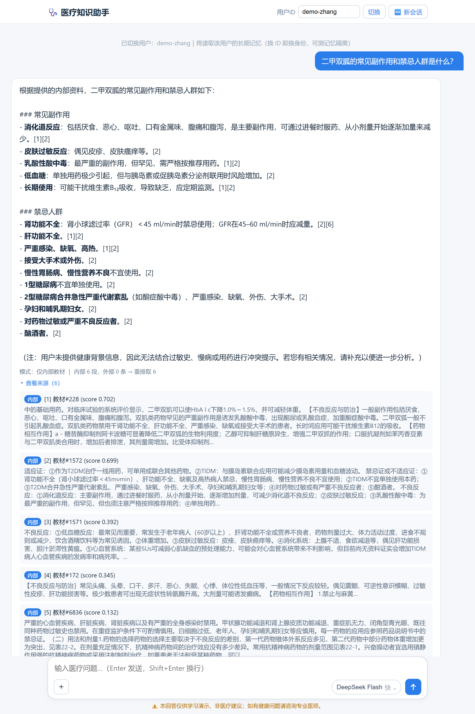
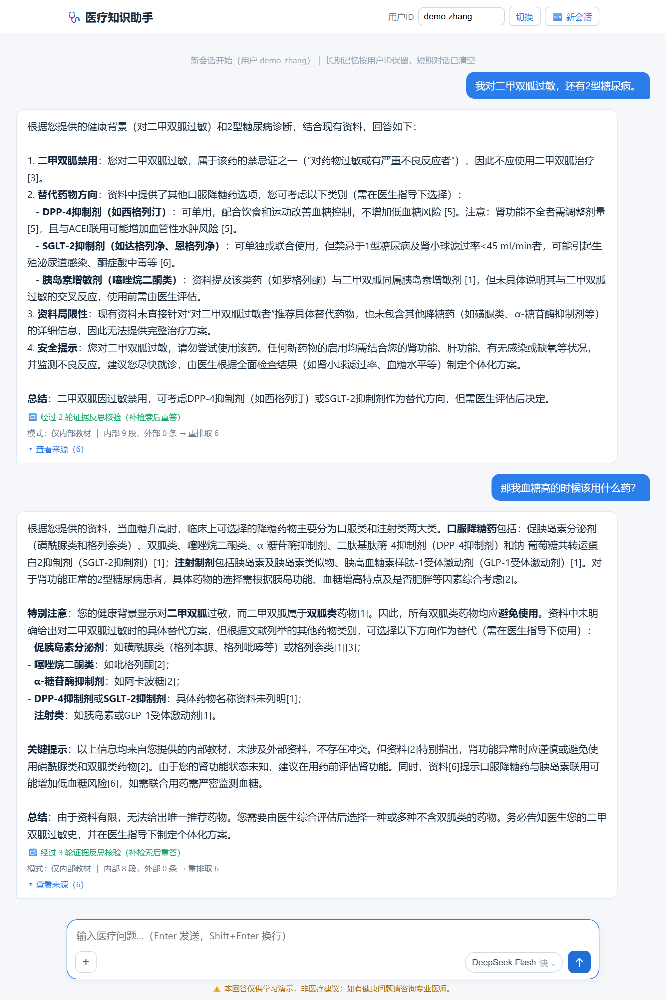

<div align="center">

# 🩺 医疗知识助手 · Medical RAG Agent

**内外部知识融合 · 带记忆 · 可溯源的中文医疗问答助手**

用 **LangGraph** 编排，把一次（可能跨多方面的）医疗问诊拆解 → 在**内部医学教材库**（Qdrant 混合检索）
与**外部 Web**（Tavily 联网）两路找证据 → 融合重排 → 由 **DeepSeek 带 `[编号]` 引用作答**，
再**自我反思**证据是否充分、不足则补检索重答，全程严格防幻觉、可溯源。

[](https://www.python.org/)
[](https://langchain-ai.github.io/langgraph/)
[](https://fastapi.tiangolo.com/)
[](https://qdrant.tech/)
[](https://platform.deepseek.com/)
[](https://www.docker.com/)
[](LICENSE)

</div>

> ⚠️ **本项目仅供学习演示，非医疗建议**；如有健康问题请咨询专业医师。

---

## ✨ 亮点速览

- **混合检索（不只是向量召回）**：Qdrant 命名向量 `dense`（bge-m3 语义）+ `sparse`（BM25 词面）双路 Prefetch → 原生 **RRF 融合** → **bge-reranker 重排** 取 top-k，专有名词/术语召回更稳。
- **知识融合**：内部教材 KB + 外部 Tavily Web 两路证据合并去重、统一重排；联网失败优雅降级只用内部源。
- **Agent 四大支柱全落地**：Planning（拆方面）· Tool Use（混合检索 + 联网）· **Reflection**（证据自检→补检索重答）· **Memory**（短期指代消解 + 长期用户健康记忆）。
- **可溯源、防幻觉**：作答只依据检索证据，强制 `[编号]` 引用、附证据来源列表，资料不足如实说明。
- **个体化安全提示**：长期记忆自动抽取用户过敏史/慢病/用药，下一轮作答主动做用药冲突提示（见下图）。
- **工程化交付**：FastAPI + **SSE 流式**（边跑边推节点进度）+ 聊天式网页前端 + Docker Compose 一键部署；本地落盘 ↔ 服务器部署**仅切环境变量、零代码改动**。

---

## 🎬 演示截图

**① 复合问题 → 计划拆解 → 混合检索 → 带 `[编号]` 引用作答 + 可展开证据来源**

<div align="center">
  
</div>

**② 多轮记忆：上一轮告知「对二甲双胍过敏」，下一轮追问换药时主动做安全提示（指代消解 + 长期记忆 + 反思核验）**

<div align="center">
  
</div>

---

## 🏗 架构 · 图主干

<div align="center">
  
</div>

记忆挂载（`med_graph.py`）：`compile(checkpointer=InMemorySaver(), store=InMemoryStore(index=BGE))`；
调用传 `config={"configurable": {"thread_id": session_id, "user_id": user_id}}`。

---

## 🧠 四大支柱 → LangGraph 映射

| 支柱 | 实现 | 关键节点 |
|------|------|----------|
| **Planning** | 复合问诊平行拆解成 1-3 个方面子问题（结构化 JSON 输出），分方面检索再汇总 | `plan` |
| **Tool Use** | 内部混合检索（BGE 向量 + BM25 + RRF + 重排）+ 外部 Tavily 联网 | `retrieve_internal` / `retrieve_external` |
| **Reflection** | answer 后自判证据充分性，不足则用具体 `missing_info` 补检索重答，`MAX_REVISIONS` 硬上限防死循环 | `reflect` / `augment_retrieve` |
| **Memory** | 短期 `InMemorySaver`（按 thread_id）撑多轮 + 指代消解；长期 `InMemoryStore`（BGE 语义检索，按 user_id）召回 + 自动抽取健康事实 | `contextualize` / `recall_memory` / `extract_memory` |

---

## 🛠 技术栈

| 层 | 选型 | 说明 |
|----|------|------|
| **LLM** | DeepSeek V4 云端 API（`langchain-deepseek`） | 默认 `deepseek-v4-flash`，难节点可切 `deepseek-v4-pro`（前端胶囊切换） |
| **向量化 + 重排** | Xinference 上的 BGE（本地 GPU） | `bge-m3` 向量 + `bge-reranker-v2-m3` 重排（打 `/v1/rerank` REST） |
| **向量库 + 混合检索** | Qdrant | 命名向量 `dense`（1024 维 COSINE）+ `sparse`（FastEmbed BM25）→ 原生 RRF |
| **外部源** | Tavily Web 搜索 | 补时效/最新指南，失败优雅降级 |
| **编排** | LangGraph（StateGraph） | 条件边走反思回路，checkpointer + Store 做记忆 |
| **服务 + 部署** | FastAPI + 原生网页前端 + Docker Compose | `/chat` 同步、`/chat/stream` SSE 流式；compose 编排 app + qdrant |

---

## 🚀 快速开始

### 前置
1. 在 [platform.deepseek.com](https://platform.deepseek.com/) 申请 API 密钥，填进 `.env` 的 `DEEPSEEK_API_KEY`。
2. Xinference 启动 `bge-m3`（向量）与 `bge-reranker-v2-m3`（重排），记下 UID 填进 `.env`。
3. （可选联网）在 [tavily.com](https://tavily.com/) 申请密钥填 `TAVILY_API_KEY`。

> BM25 稀疏模型已随仓库预置离线缓存（`fastembed_cache/`），clone 即用，无需联网下载。

### 本地运行
```bash
pip install -r requirements.txt
cp .env.example .env          # 填密钥与模型 UID

python ingest.py --recreate   # 灌库（首次，走 Xinference 向量化）
python med_rag.py "二甲双胍的副作用和禁忌"          # CLI 单次问答
python med_rag.py "高血压一线药的副作用" --web      # 融合联网
python med_rag.py --chat                            # 多轮对话（带记忆）

uvicorn server:app --reload   # 起 Web 服务 → http://localhost:8000
```

### Docker 部署
```bash
docker compose up -d qdrant            # 1. 起向量库服务器
export QDRANT_URL=http://localhost:6333 && python ingest.py --recreate  # 2. 灌库
docker compose up -d --build app       # 3. 起 app → http://localhost:8000
```


**本地落盘 → 容器部署只切环境变量 `QDRANT_URL`，零代码改动。** Xinference 留宿主机（GPU），app 容器经 `host.docker.internal:9997` 连。

---

## 📁 目录结构

```
config.py        端点 / 模型 / UID（.env 覆盖，唯一配置入口）
llm.py           ChatDeepSeek 封装
embeddings.py    Xinference BGE 向量化 + 重排（/v1/rerank REST）
sparse.py        FastEmbed BM25 稀疏向量（混合检索的词面路）
vectordb.py      Qdrant 客户端工厂（本地落盘 / 服务器双模式）
ingest.py        灌库管道：教材 → 切块 → dense+sparse → 写 Qdrant
kb_search.py     内部检索：混合召回（dense+sparse RRF）+ BGE 重排
external.py      Tavily Web 搜索
med_state.py     图状态 MedState
med_nodes.py     节点：plan / retrieve_* / fuse / answer / reflect / *_memory
med_graph.py     组装 StateGraph 并 compile（挂 checkpointer + Store）
med_rag.py       CLI 入口：python med_rag.py "问题" [--web] [--chat]
server.py        FastAPI 服务：/ /health /chat /chat/stream(SSE)
static/index.html 聊天式网页前端（联网开关 + 模型切换胶囊）
Dockerfile / docker-compose.yml / .dockerignore   容器化部署
docs/            逐阶段设计文档 P0→P6（见 docs/README.md）+ 演示图（images/）
```

---

## 📈 进度路线（P0 → P6）

| 阶段 | 内容 | 状态 |
|------|------|------|
| **P0** | Qdrant 持久向量库 + 医疗 KB 灌库 + 混合检索（dense+sparse+RRF+rerank） | ✅ |
| **P1** | 医疗 RAG 基线（问诊 → 混合检索 → 带引用作答） | ✅ |
| **P2** | +Planning（复合问题拆方面 → 分方面检索 → 汇总） | ✅ |
| **P3** | 知识融合（内部教材 KB + 外部 Tavily Web，带联网开关） | ✅ |
| **P4** | +Reflection（答完自判证据充分性，不足则补检索重答，带修订上限） | ✅ |
| **P5** | +Memory（短期多轮指代消解 + 长期用户健康记忆，自动抽取+召回+安全提示） | ✅ |
| **P6** | FastAPI + SSE 流式 + 聊天式网页前端 + Docker 容器化（端到端验证） | ✅ |
| 持久化记忆 | 内存版 → SqliteSaver + Qdrant-backed Store（重启不丢） | 🚧 待做 |

---

## 📝 评测

医疗答复是开放长文本、无唯一标准答案，EM/F1 失效。拆成**检索层**（客观、可回归）与**答案层**（LLM-as-judge）
分别评；脚本集中在 [`eval/`](eval/)，完整方法论与排查复盘见 [`docs/EVAL.md`](docs/EVAL.md)。

### 检索层：recall@k / MRR + 逐层消融

对「金标 chunk 是否召回、排得够前」做三方式**逐层加码**对比，量化每一层的增益；外加**切分策略 A/B**（结构 vs 递归）
的公平子集实验。

| 检索方式 | 说明 |
|---|---|
| `dense` | 纯 bge-m3 稠密语义 |
| `hybrid(RRF)` | + sparse/BM25 词面，Qdrant 原生 RRF 融合 |
| `hybrid+rerank` | + bge-reranker 精排（线上完整路径） |

> **🔍 评测照出的一次静默退化（本项目最有价值的一次产出）**
> 修复前 `hybrid(RRF)` 与纯 `dense` **每个 k 的指标逐条完全一致** —— 两条不同检索路径不可能巧合相等 →
> 判定 sparse 那路退化成空、RRF 退化为纯 dense → 定位到 FastEmbed BM25 **不切连续中文**、查询侧 sparse 向量
> 近乎为空 → 引入 jieba 分词、**增量重建 sparse 索引**（不动 dense）→ 复测 sparse 贡献恢复（`hybrid R@3 0.688→0.750`、
> MRR 同步小升）。**价值不在「修了个 bug」，而在「评测抓住了一个肉眼不可见的静默故障」。**

### 答案层：reference-free LLM-as-judge + 消融

裁判**只对照本次检索到的证据**评判（不引入自身医学知识，避免把「证据没提但模型知道」误判成幻觉），
四维各 1–5：忠实度 / 引用正确性 / 完整性 / 安全合规。

- **抓出合规 bug**：首评 safety 仅 3.54（免责声明原只在 CLI 拼接、图产出的答案不带）→ 在 `answer` 节点
  **确定性追加**免责声明，CLI / Web / 评测三面统一 → **safety 3.54 → 5.00**。
- **反思 on/off 消融**：均值持平，但逐题分析显示反思是「**安全网**」—— 在安全敏感、首检索不足的难题上把
  faithfulness 从 3 救到 5；据医疗风险不对称，生产保留反思。

> **逐阶段设计文档（P0→P6）见 [`docs/`](docs/README.md)**，讲清每层的目标与设计取舍。

## 📄 License

[MIT](LICENSE) · 仅供学习与作品集演示。