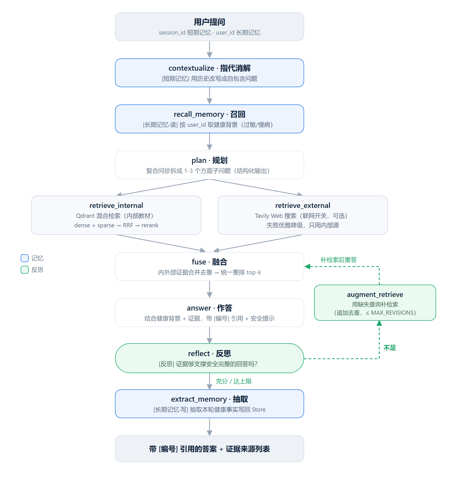

# 设计文档索引

医疗知识助手的**逐层演进**记录：每个阶段一篇设计文档，讲清**当阶段的目标、关键设计取舍、
实现与验证**。整体定位见根目录 [README](../README.md)。

  

## 演进路线（P0 → P6）

| 阶段 | 主题 | 一句话 | 文档 |
|------|------|--------|------|
| **P0** | 检索底座 | 教材灌库 + 混合检索（dense+sparse → RRF → 重排），带来源元数据可溯源 | [P0_DESIGN](P0_DESIGN.md) |
| **P1** | RAG 基线 | 问诊 → 检索 → 带 `[编号]` 引用作答，只依据资料、防幻觉 | [P1_DESIGN](P1_DESIGN.md) |
| **P2** | Planning | 复合问诊**平行拆解**成 1-3 个方面子问题，分方面检索再汇总 | [P2_DESIGN](P2_DESIGN.md) |
| **P3** | 知识融合 | 内部教材 + 外部 Tavily Web 两路证据**统一重排**，联网开关 + 优雅降级 | [P3_DESIGN](P3_DESIGN.md) |
| **P4** | Reflection | 答完**自检证据充分性**，不足则用具体缺失查询补检索重答，带修订上限 | [P4_DESIGN](P4_DESIGN.md) |
| **P5** | Memory | 短期多轮**指代消解** + 长期**用户健康记忆**（自动抽取 + 召回 + 安全提示） | [P5_DESIGN](P5_DESIGN.md) |
| **P6** | 部署 | FastAPI + SSE 流式 + 聊天前端 + Docker（本地/服务器双模式零改动） | [P6_DEPLOY](P6_DEPLOY.md) |

## 四大支柱 → 阶段对应

| Agent 支柱 | 落在哪 |
|------------|--------|
| **Planning** | [P2](P2_DESIGN.md) |
| **Tool Use** | [P0](P0_DESIGN.md) 混合检索 + [P3](P3_DESIGN.md) 外部联网 |
| **Reflection** | [P4](P4_DESIGN.md) |
| **Memory** | [P5](P5_DESIGN.md) |

## 评测

完整方法论、切分 A/B 消融、以及一次**混合检索静默退化**的排查与修复，见 **[EVAL](EVAL.md)**。

- **检索 recall@k / MRR**：`eval/eval_retrieval.py`（金标集由 `eval/gen_eval_set.py` 生成）——金标 chunk 是否被召回、排得够不够前。
- **切分 A/B + 逐层消融**：`eval/run_chunk_eval.py`（dense → hybrid → rerank）。
- **混合 vs 纯 dense 对比**：`eval/compare_retrieval.py`。
- **答案质量**：医疗答复是开放长文本、EM/F1 失效，用 **LLM-as-judge** 评「忠于证据 / 引用对应 / 无幻觉」。

> ⚠️ 本项目仅供学习演示，**非医疗建议**。